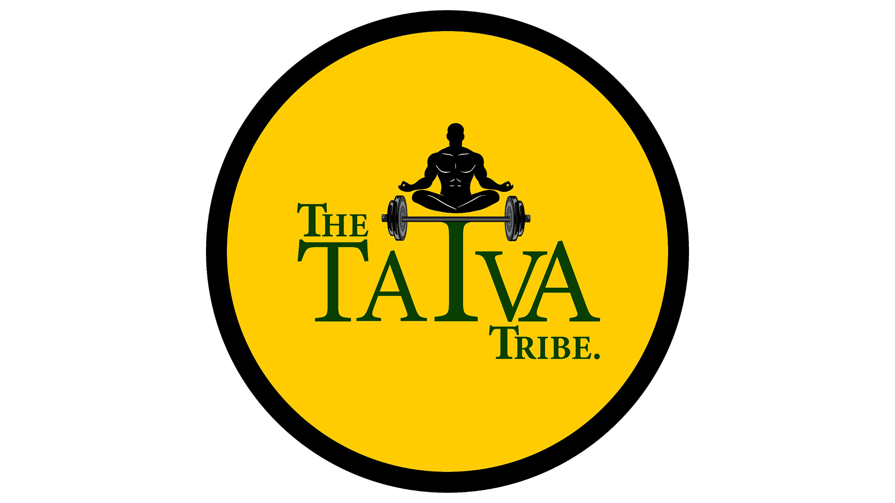

# The Tatva Tribe — Website QA Test Report

| | |
|---|---|
| **Date** | 2026-06-10 |
| **Branch** | `wonderful-torvalds-b40aac` (off `main`) |
| **Site** | https://thetatvatribe.com |
| **Stack** | React 19 + Vite 7, React Router 7, Tailwind CSS 3 |
| **Build** | ✅ `vite build` passes · ✅ `eslint .` clean |
| **Verdict** | Site is well-built. **2 issues found.** BUG‑01 fixed & verified on the live dev server; BUG‑02 identified — fix deferred at the owner's request. |

---

## 1. Executive summary

The site was tested end-to-end: all 4 routes + the 404 page, every interactive
component, all network requests, the console, responsive layouts, and the
production build. The codebase is clean and accessible.

Two defects were found:

| ID | Severity | Title | Status |
|----|----------|-------|--------|
| **BUG‑01** | 🔴 High (functional) | Scroll position not reset when navigating between pages | ✅ Fixed & verified |
| **BUG‑02** | 🟠 Medium (SEO / social) | Shared links have no preview image (missing Open Graph / Twitter image) | ⏸ Identified — fix deferred (owner decision) |

No console errors, no failed network requests, no broken images, and no layout
overflow were found anywhere on the site.

---

## 2. Test environment & method

- **Runner:** live Vite dev server (`npm run dev`, port 5173) driven through a headless browser.
- **Checks per page:** DOM/ARIA structure, all `` / iframe / font network statuses, browser console (errors + warnings), runtime measurements (scroll offset, element geometry), responsive widths (375 / 749 / 1280 px), and the production build output.
- **Note on screenshots:** this sandbox's screenshot capture became unresponsive after the first few frames (a known limitation of this environment). Where a static image would normally be shown, the report instead records the exact runtime measurement that was asserted — these are reproducible and, for the behavioral bug below, stronger evidence than a screenshot. The brand share image proposed for BUG‑02 is embedded directly from the repo in §5.

---

## 3. What was tested — results matrix

| Area | Test | Result | Evidence |
|------|------|--------|----------|
| **Home `/`** | Renders, hero, CTA | ✅ PASS | `h1 = "SMARTWORK over Hardwork"`, CTA → `/contact` |
| Home | 7 Tatva images load | ✅ PASS | 7/7 images `200 OK` |
| **About `/about`** | Renders, trainer image | ✅ PASS | `trainer.jpeg 200`, hero + bio render |
| About | Certifications carousel — next / prev / dots | ✅ PASS | `translateX` steps `+1 / −1`, dot jump to index 0 |
| About | Carousel autoplay + pause | ✅ PASS | advances every 4.5 s; `aria-pressed=true` halts it |
| About | All 6 certificate images load | ✅ PASS | incl. `.PNG` (uppercase) files — `200 OK` on case‑sensitive paths |
| **Pricing `/pricing`** | 4 plans + prices + 5 T&C | ✅ PASS | ₹9,999 / 24,999 / 37,999 / 79,999; 5 terms |
| **Contact `/contact`** | Google Form iframe embeds | ✅ PASS | iframe `200 OK`, 740×800, correct title |
| **404** | Unknown route → Not‑Found page | ✅ PASS | shows "404", "Back to Home", "Contact Us" |
| **Navbar** | Desktop nav (≥768 px) | ✅ PASS | links + active state render, full‑width |
| **Navbar** | Mobile menu (375 px) toggle / navigate / auto‑close | ✅ PASS | `aria-expanded` toggles; link navigates and closes menu |
| **Layout** | Horizontal overflow @1280 px | ✅ PASS | `scrollWidth == clientWidth` (no overflow) |
| **Console** | Errors / warnings across all pages | ✅ PASS | none |
| **Network** | Failed requests | ✅ PASS | none |
| **Build** | `vite build` / `eslint .` | ✅ PASS | build OK, lint clean |
| **Navigation scroll** | New page starts at top | ❌→✅ | **BUG‑01** — see §4 |
| **Social share** | Link preview image | ❌ open | **BUG‑02** — see §5 (fix deferred) |

---

## 4. BUG‑01 — Scroll position not reset on page navigation 🔴

**Severity:** High — affects every page navigation.

### Symptom
Scrolling down a page and then clicking a nav link took you to the new page but
**kept the old scroll offset**, dropping you into the middle of the new page
instead of at its top.

### Reproduction (before fix)
1. On `/` (Home), scroll down to ~1700 px.
2. Click **About** in the nav.
3. **Observed:** URL becomes `/about` but the viewport is still at scrollY **1700** — you land mid‑page.

| Action | Scroll before nav | Scroll after nav | Expected |
|---|---|---|---|
| Home → About | 1700 | **1700** ❌ | 0 |

### Root cause
`ScrollToTop` in `src/App.jsx` called `window.scrollTo(0, 0)`. But `index.css`
sets `html { scroll-behavior: smooth }`, which turns that call into an
*animated* scroll. The animation is immediately interrupted by the incoming
route's re-render, so it never reaches the top — leaving the page stranded at
the previous offset.

### Fix — `src/App.jsx`
```diff
  useEffect(() => {
-   window.scrollTo(0, 0);
+   // `behavior: 'instant'` is required: <html> has `scroll-behavior: smooth`
+   // (index.css), which otherwise turns this reset into an animated scroll.
+   // That animation gets cancelled by the incoming route's re-render, leaving
+   // the new page stuck at the previous scroll offset instead of the top.
+   window.scrollTo({ top: 0, left: 0, behavior: 'instant' });
  }, [pathname]);
```

### Verification (after fix)
Every cross‑page navigation from a scrolled position now lands at the top:

| Action | Scroll before nav | Scroll after nav | Result |
|---|---|---|---|
| Home → About | 1700 | **0** | ✅ PASS |
| About → Pricing | 1200 | **0** | ✅ PASS |
| Pricing → Contact | 900 | **0** | ✅ PASS |

---

## 5. BUG‑02 — Missing social share image (Open Graph / Twitter) 🟠

**Severity:** Medium — affects every link shared to WhatsApp, Instagram DMs,
Facebook, LinkedIn, X, etc. For an Instagram‑driven brand, link previews matter.

**Status: identified, NOT fixed — fix deferred at the owner's request.**
The recommended change below is documented so it can be applied later.

### Symptom
`index.html` has `og:title`, `og:url`, and `og:description` but **no
`og:image`** and no Twitter Card tags. Shared links render as a bare text
preview with no image.

### Recommended fix — `index.html` (not applied)
Add the share image, dimensions, alt text, site name, and the full Twitter
Card block (pointing at the existing high‑res brand logo):

```html
<meta property="og:site_name" content="The Tatva Tribe" />
<meta property="og:image" content="https://thetatvatribe.com/images/logo-favicon-source.png" />
<meta property="og:image:width" content="1920" />
<meta property="og:image:height" content="1080" />
<meta property="og:image:alt" content="The Tatva Tribe logo" />
<meta name="twitter:card" content="summary_large_image" />
<meta name="twitter:title" content="The Tatva Tribe - Holistic Fitness Coaching" />
<meta name="twitter:description" content="Beyond Just Workouts — Towards Wholeness. Join the tribe for sustainable fitness transformation." />
<meta name="twitter:image" content="https://thetatvatribe.com/images/logo-favicon-source.png" />
```

### Proposed share image (existing repo asset — no new file needed)



### Asset readiness (verified)
| Check | Result |
|---|---|
| Share image resolves | ✅ `HTTP 200`, `content-type: image/png` |
| Image dimensions | ✅ 1920×1080 (valid large‑image ratio) |

---

## 6. Observations — not bugs, recommended cleanups

These do **not** affect users and were left unchanged, but are worth tidying later:

| # | Item | Note |
|---|------|------|
| 1 | `src/components/ui/Button.jsx` is unused | Pages use the `.btn` CSS classes instead. Dead code — safe to delete. |
| 2 | `@emailjs/browser` dependency is unused | Contact uses a Google Form iframe; the package isn't imported anywhere. Safe to remove from `package.json`. |
| 3 | `public/images/logo.png` is a JPEG with a `.png` extension | Browsers sniff and render it fine (loads `200 OK`), so no visible impact. Re‑encode to true PNG when convenient. |
| 4 | Mobile menu uses a fixed `max-h-80` (320 px) cap | Current content is ~294 px, so it fits — but headroom is tight if links are ever added. Consider `max-h-96`. |
| 5 | Certifications carousel autoplays regardless of `prefers-reduced-motion` | It has a working Pause control (meets WCAG 2.2.2), but could also pause automatically under reduced‑motion. |

---

## 7. Conclusion

The website is in good shape: clean build, no console errors, no broken assets,
responsive across breakpoints, and solid accessibility fundamentals
(ARIA labels, focus styles, reduced‑motion handling, semantic landmarks).

The one **functional** bug — navigation not scrolling to the top — is fixed and
verified. The **social‑sharing** gap (BUG‑02) remains open by choice: a
ready‑to‑apply fix is documented in §5 for whenever the owner wants it. The
shipped change is low‑risk and passes lint + build.
